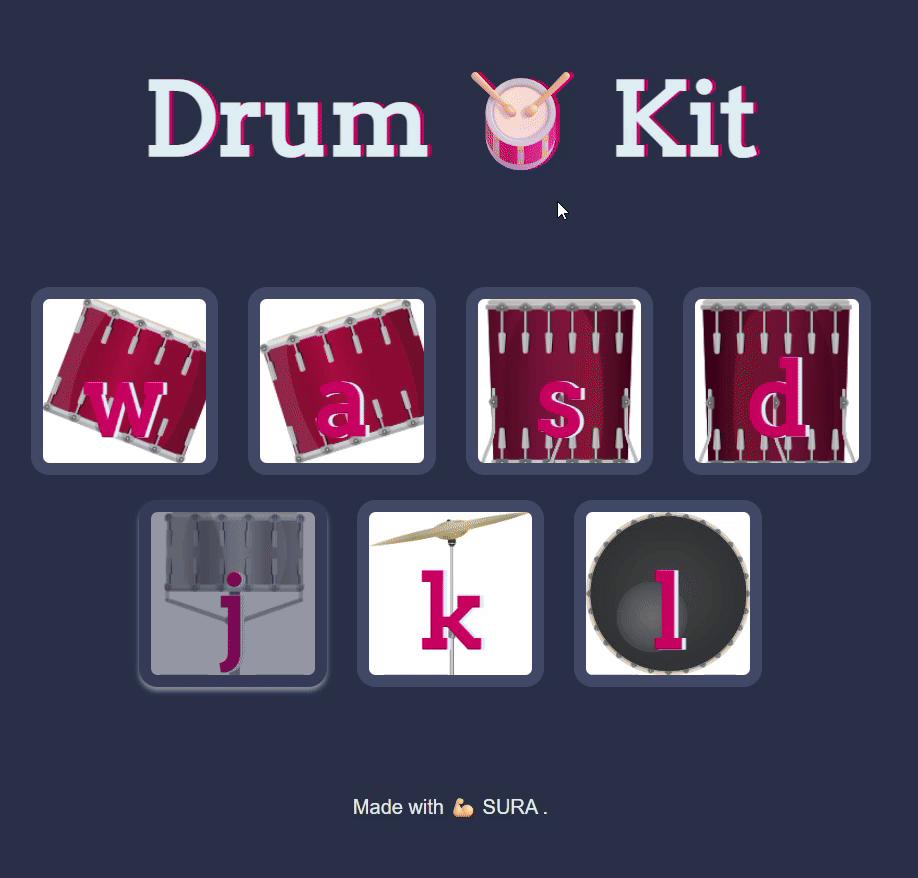

# 🥁 Drum Kit

An interactive web-based drum kit built with vanilla HTML, CSS, and JavaScript. Play drum sounds by pressing keyboard keys or clicking buttons. Perfect for learning event handling and audio integration in web development!

## Drum Kit Preview

### ✨ Features

-🎹 **9 Drum Pads** - Snare, Kick, Floor Tom, Hi-Hat, and more.

-⌨️ **Keyboard Support** - Press keys (N, A, S, D, J, K, L, I) to play sounds.

-🖱️ **Mouse Click Support** - Click buttons to trigger drum sounds.

-🎵 **Realistic Drum Sounds** - High-quality audio samples.

-💥 **Visual Feedback** - Buttons light up when pressed

-📱 **Responsive Design** - Works on desktop and tablet devices

-🎨 **Modern UI** - Clean, modern interface with smooth animations

